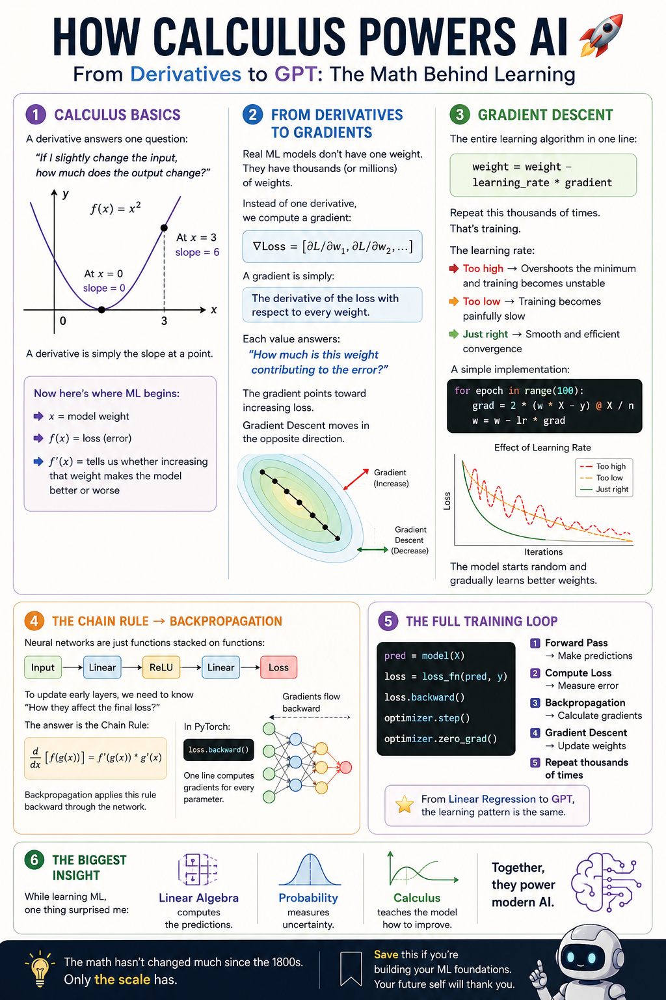

# Calculus and Gradient Descent



Day 1 introduced how data is structured through linear algebra, and Day 2 explored uncertainty through probability. Day 3 focuses on the engine behind machine learning: **how a model learns from its mistakes and improves its predictions**.

A model begins with initial weights, makes predictions, measures its error, and adjusts those weights. Calculus tells the model which adjustments will reduce the error.

## What I Learned

- What a derivative represents and why slope matters in machine learning
- How partial derivatives combine to form a gradient
- How gradient descent updates model weights to minimize loss
- Why the learning rate controls the speed and stability of training
- How the chain rule makes backpropagation possible
- How SGD, mini-batch gradient descent, and Adam differ
- How to implement gradient descent from scratch with NumPy
- How PyTorch automates gradient calculation and parameter updates

## 1. Derivatives

A derivative measures how much the output of a function changes when its input changes slightly. In other words, it gives the slope at a particular point.

For example:

```text
f(x)  = x²
f'(x) = 2x
```

- At `x = 3`, the derivative is `6`, so the function is increasing steeply.
- At `x = 0`, the derivative is `0`, meaning the curve is flat at its minimum.

In machine learning, `x` can represent a model weight and `f(x)` can represent the loss. The derivative tells us whether increasing that weight will make the loss increase or decrease.

## 2. Gradients

A derivative describes change with respect to one variable. A model usually contains many weights, so it needs a **gradient**: a vector containing the partial derivative for every weight.

```text
∇L = [∂L/∂w₁, ∂L/∂w₂, ∂L/∂w₃, ...]
```

Each component measures how much one weight affects the loss. The gradient points toward the steepest increase in loss, so training moves in the opposite direction.

## 3. Gradient Descent

The central weight-update rule is:

```text
weight = weight - learning_rate × gradient
```

The model repeatedly:

1. Makes a prediction.
2. Calculates the loss.
3. Computes the gradients.
4. Updates its weights in the direction that reduces the loss.

### Learning rate

The learning rate controls the size of each update:

| Learning rate | Result |
| --- | --- |
| Too high | Overshoots the minimum and may cause the loss to diverge |
| Too low | Converges very slowly and wastes computation |
| Well chosen | Produces smooth and efficient convergence |

A simple implementation from the notebook:

```python
weight = 5.0
learning_rate = 0.1

def loss(w):
    return (w - 2) ** 2 + 1

def gradient(w):
    return 2 * (w - 2)

for step in range(20):
    grad = gradient(weight)
    weight -= learning_rate * grad
    print(f"Step {step + 1}: w={weight:.4f}, loss={loss(weight):.4f}")
```

The weight begins at `5.0` and gradually approaches `2.0`, where the loss is minimized.

## 4. Chain Rule and Backpropagation

Neural networks are composed of nested functions. The chain rule calculates how an early operation affects the final output:

```text
If y = f(g(x)), then dy/dx = f'(g(x)) × g'(x)
```

In a neural network:

```text
Input → Linear layer → ReLU → Output → Loss
```

Gradients are multiplied backward through these operations. This process is called **backpropagation**. PyTorch performs it automatically with:

```python
loss.backward()
```

## 5. Optimizers

| Optimizer | How it works | Typical use |
| --- | --- | --- |
| SGD | Updates using individual samples or basic gradients | Baselines and simple models |
| Mini-batch gradient descent | Updates using small batches, commonly 32–256 samples | Standard deep-learning training |
| Adam | Adapts the learning rate for each parameter | A strong default for many neural networks |

## The PyTorch Training Loop

```python
predictions = model(X)                 # Forward pass
loss = loss_function(predictions, y)   # Measure error
optimizer.zero_grad()                  # Clear previous gradients
loss.backward()                        # Compute new gradients
optimizer.step()                       # Update parameters
```

Most neural-network training scripts are variations of these five steps.

## Mini-Project - Linear Regression from Scratch

The notebook builds a small model for data generated from:

```text
y = 3x + noise
```

The model starts with `w = 0` and `b = 0`. Using only NumPy, mean squared error, and manually calculated gradients, it learns values close to:

```text
Learned: y ≈ 3x + 0
```

This demonstrates that model training is not magic: repeated gradient-based updates allow the model to recover the underlying relationship in the data.

## Repository Contents

| File | Description |
| --- | --- |
| [`Calculus.ipynb`](Calculus.ipynb) | Notes, examples, PyTorch training steps, and the gradient-descent mini-project |
| [`Day-3.png`](Day-3.png) | Day 3 visual resource |
| [`Day-3.1.png`](Day-3.1.png) | Additional Day 3 visual resource |

## Run the Notebook

1. Clone or download this repository.
2. Create and activate a Python environment.
3. Install the required packages:

```bash
pip install jupyter numpy torch
```

4. Launch Jupyter:

```bash
jupyter notebook Calculus.ipynb
```

## Day 3 in One Minute

The complete learning process is:

```text
Make predictions
      ↓
Measure the loss
      ↓
Calculate gradients with backpropagation
      ↓
Update weights with an optimizer
      ↓
Repeat until the loss stops improving
```

The key idea is simple: a model learns by measuring its error, finding which direction would increase that error, and moving its weights in the opposite direction.

## How the Foundations Connect

| Topic | Role in machine learning |
| --- | --- |
| Linear algebra | Represents data, weights, and transformations |
| Probability | Models uncertainty and helps define loss functions |
| Calculus | Provides gradients for learning and optimization |

Together, these topics form the mathematical foundation of machine learning.


## Quick Knowledge Check

1. If the loss increases during training, what might that suggest about the learning rate?
2. What does `loss.backward()` calculate?
3. If the gradient at the current weight is negative, in which direction will gradient descent update the weight?
4. What is the difference between a derivative and a gradient?
5. Why must `optimizer.zero_grad()` be called during a PyTorch training loop?

<details>
<summary><strong>Answer key</strong></summary>

1. **The learning rate may be too high.** Large updates can overshoot the minimum, making training unstable and causing the loss to increase. An increasing loss can have other causes, but lowering the learning rate is a good first check.
2. **`loss.backward()` computes the gradients of the loss with respect to every trainable model parameter.** PyTorch applies the chain rule backward through the computation graph and stores each result in the parameter's `.grad` attribute.
3. **The weight increases.** The update rule is `w = w - learning_rate × gradient`. Subtracting a negative gradient adds a positive value to the weight.
4. **A derivative measures change with respect to one variable, while a gradient collects the partial derivatives for many variables into a vector.** A model with many weights therefore uses a gradient to determine how each weight affects the loss.
5. **PyTorch accumulates gradients by default.** Calling `optimizer.zero_grad()` clears gradients from the previous training step so they are not unintentionally added to the new gradients.


</details>

---

**Main takeaway:** derivatives measure change, gradients show the direction of greatest increase, and gradient descent moves in the opposite direction to help a model learn.
